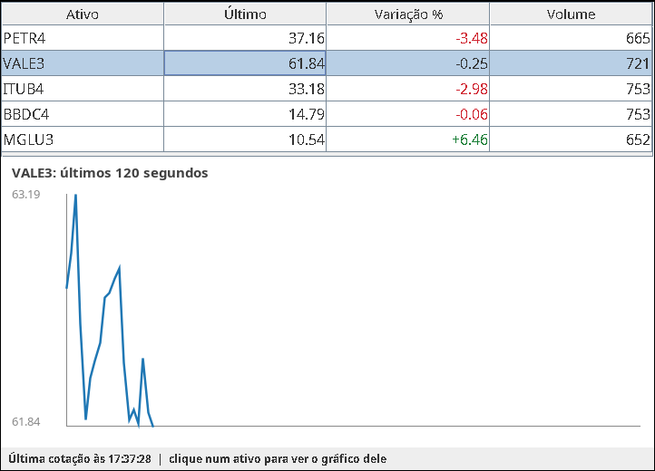

# Mini Bolsa de Valores

Trabalho da disciplina **Programação Concorrente e Paralela** (BCC).

Uma bolsa de valores simplificada: usuários e robôs se conectam por socket,
enviam ordens de compra e venda de ações, as ordens são casadas num livro de
ofertas e os preços mudam em tempo real.

O domínio é só o pretexto. O objetivo é demonstrar, num exemplo fácil de
explicar:

- atendimento concorrente de clientes com o framework **Executor**;
- processamento **single-writer** por ativo (um executor por ação) comparado a um **lock global**;
- **condições de corrida** reais (saldo negativo, dinheiro que some) e sua correção;
- **deadlock** numa transferência entre contas e sua prevenção por **ordenação de locks**;
- **produtor/consumidor** (fila de saída por cliente), tarefas periódicas e medição de desempenho.

O [DESIGN.md](DESIGN.md) explica onde está cada conceito no código e por quê.

## Requisitos

- JDK 21 ou mais novo. O projeto é desenvolvido com o JDK 25 e compilado com `--release 21`.
- Maven não é necessário: o projeto traz o Maven Wrapper (`mvnw` / `mvnw.cmd`).

## Compilar e testar

```sh
./mvnw verify          # Linux/macOS
mvnw.cmd verify        # Windows
```

Os testes levam cerca de 30 segundos. O jar fica em `target/mini-bolsa.jar`.

## Modos

Um único jar; o primeiro argumento escolhe o modo. `help` lista todas as opções.

```sh
java -jar target/mini-bolsa.jar help
```

| Modo | O que faz | Opções principais |
|---|---|---|
| `server` | servidor da bolsa | `--port 9000`, `--engine single-writer\|global-lock`, `--audit-every N`, `--unsafe-accounts`, `--race-window-ms N`, `--naive-transfer`, `--transfer-pause-ms N` |
| `client` | cliente de terminal (para quem não tem `nc`) | `--host localhost`, `--port 9000` |
| `bots` | robôs que negociam sozinhos | `--count 50`, `--rate 10` (ações/s por robô), `--transfer-storm` |
| `bench` | benchmark do motor de ordens, gera um CSV | `--orders 200000`, `--repetitions 5`, `--output benchmark.csv` |
| `monitor` | janela com a tabela de cotações e o gráfico de preço | `--host localhost`, `--port 9000` |

Opção desconhecida é erro, para que uma flag digitada errado não seja ignorada no
meio de uma demonstração.

## Como jogar

```sh
java -jar target/mini-bolsa.jar server                 # terminal 1
java -jar target/mini-bolsa.jar client                 # terminais 2 e 3 (ou: nc localhost 9000)
```

Toda conta nova começa com R$ 100.000,00 e 1.000 ações de cada ativo (PETR4,
VALE3, ITUB4, BBDC4, MGLU3). Comandos e ativos aceitam maiúsculas ou minúsculas,
e os preços usam ponto (`38.50`). Uma sessão com dois terminais (`>` marca o
que foi digitado):

```
terminal 2 (ana)                         terminal 3 (bia)
> LOGIN ana                              > LOGIN bia
OK LOGIN ana 100000.00                   OK LOGIN bia 100000.00
> SELL PETR4 100 38.50
OK ORDER 1
                                         > BUY PETR4 60 39.00
                                         OK ORDER 2
                                         FILL 2 PETR4 BUY 60 38.50
FILL 1 PETR4 SELL 60 38.50
                                         > PORTFOLIO
                                         PORTFOLIO bia
                                         CASH 97690.00 0.00
                                         SHARES PETR4 1060 0
                                         ...
                                         END
```

A bia aceitou pagar até 39,00, mas pagou 38,50, o preço de quem já estava no
livro, e recebeu a diferença de volta.

| Comando | Resposta |
|---|---|
| `LOGIN <nome>` | `OK LOGIN <nome> <saldo>` (cria a conta se não existir) |
| `BUY <ATIVO> <QTD> <PRECO>` / `SELL ...` | `OK ORDER <id>` (ordem limitada: aceita e reservada) |
| `CANCEL <id>` | `OK CANCEL <id> <qtd_cancelada>` |
| `BOOK <ATIVO>` | `BOOK <ATIVO>`, até 5 linhas `BID`/`ASK <preco> <qtd>` por lado, `END` |
| `PORTFOLIO` | `CASH <disponivel> <reservado>`, uma linha `SHARES <ATIVO> <disponiveis> <reservadas>` por ativo, `END` |
| `ORDERS` | uma linha `ORDER <id> <ATIVO> <lado> <restante> <original> <preco>` por ordem aberta, `END` |
| `SUBSCRIBE <ATIVO\|ALL>` | `OK SUBSCRIBE ...` e, a cada segundo, `TICK` |
| `TRANSFER <usuario> <valor>` | `OK TRANSFER <usuario> <valor>` |
| `STATS` | `STATS orders=… trades=… clients=… violations=… deadlocks=…` |
| `HELP` / `QUIT` | a lista de comandos / `OK BYE` |

Mensagens que chegam a qualquer momento:

- `FILL <id> <ATIVO> <BUY|SELL> <qtd> <preco>`: uma ordem sua foi executada;
- `TICK <ATIVO> <ultimo_preco> <variacao_%> <volume>`: cotação, com a variação
  sobre o preço inicial e o volume desde que o servidor subiu.

Erros: `ERR <CODIGO> <mensagem>`. Os códigos são `NAO_AUTENTICADO`,
`COMANDO_INVALIDO`, `ATIVO_INEXISTENTE`, `SALDO_INSUFICIENTE`,
`ACOES_INSUFICIENTES`, `ORDEM_INEXISTENTE` e `USUARIO_INEXISTENTE`. Antes do
`LOGIN`, só `HELP` e `QUIT` funcionam.

### Monitoramento

- `--audit-every N`: a cada N segundos o servidor verifica as cinco invariantes
  (conservação do dinheiro e das ações, reservas coerentes, livros não cruzados).
  Se tudo estiver certo, loga `Auditoria: as cinco invariantes valem.`; se não,
  mostra cada violação nova com `!!! AUDITORIA`.
- O watchdog de deadlock roda sempre. Se threads ficarem presas esperando umas
  pelas outras, o log mostra `!!! DEADLOCK` com quem espera quem.
- Cada linha de log traz a hora e o nome da thread (`cliente-3-leitor`,
  `livro-PETR4`, `transferencia-1`, `auditoria`, ...).

### Robôs

```sh
java -jar target/mini-bolsa.jar bots --count 50 --rate 10
```

Cada robô abre a sua conexão (`robo-1`, `robo-2`, ...) e assina as cotações.
`--rate` vezes por segundo, compra ou vende uma quantidade pequena a até 2% do
último preço, e de vez em quando cancela uma ordem antiga. A cada 5 segundos o
modo `bots` imprime um resumo. Com `--transfer-storm`, os robôs formam pares e
cada um transfere R$ 1,00 para o outro sem parar, em vez de negociar.

### Monitor gráfico

```sh
java -jar target/mini-bolsa.jar monitor --host localhost --port 9000
```

Uma janela Swing que se conecta como cliente (usuário `monitor`) e assina todas
as cotações. A tabela mostra o último preço, a variação (verde quando sobe,
vermelha quando cai) e o volume de cada ativo. O gráfico mostra os últimos 2
minutos do ativo selecionado; clique numa linha da tabela para trocar. Com os
robôs rodando, os preços se mexem a cada segundo:



Precisa de uma tela: num ambiente sem interface gráfica, o modo avisa e sai.

## Demonstrações

Cada uma usa alguns terminais abertos na pasta do projeto, depois de
`./mvnw verify`. Para trocar a configuração do servidor, pare-o com Ctrl+C e
suba de novo com as outras flags. As contas começam do zero a cada subida.

### 1. Muita concorrência, nenhuma violação

```sh
java -jar target/mini-bolsa.jar server --audit-every 5          # terminal 1
java -jar target/mini-bolsa.jar bots --count 50 --rate 10       # terminal 2
java -jar target/mini-bolsa.jar client                          # terminal 3: LOGIN obs, depois STATS algumas vezes
```

O que observar:

- no servidor, a cada 5 s, `Auditoria: as cinco invariantes valem.`;
- no cliente, o `STATS` crescendo e sempre com `violations=0`. Numa execução de 60 s:
  `orders=8472` aos 20 s, `16787` aos 40 s e `24822` aos 60 s, com cerca de 300
  negócios por segundo.

São 50 conexões e 500 ações por segundo, com cinco livros em paralelo e
liquidações mexendo nas mesmas contas o tempo todo. Mesmo assim, o dinheiro e as
ações se conservam.

### 2. A corrida no saldo

**À mão, com dois terminais.** A janela de corrida de 2 s dá tempo de digitar:

```sh
java -jar target/mini-bolsa.jar server --unsafe-accounts --race-window-ms 2000 --audit-every 2   # terminal 1
java -jar target/mini-bolsa.jar client                                                          # terminais 2 e 3
```

1. Nos terminais 2 e 3: `LOGIN ana` (a mesma conta, com R$ 100.000,00).
2. Nos dois, com menos de 2 s de diferença: `BUY PETR4 1000 60.00` (R$ 60.000,00 cada).
3. Os dois recebem `OK ORDER`. Em qualquer um: `PORTFOLIO` mostra
   `CASH -20000.00 120000.00`.
4. No terminal 1: `!!! AUDITORIA ... conta 1 (ana): dinheiro negativo ...`.

Sem o lock da conta, as duas threads verificam o saldo (100.000 ≥ 60.000),
esperam na janela e as duas debitam. Suba de novo **sem** `--unsafe-accounts`
(mesma janela) e repita. O segundo terminal recebe
`ERR SALDO_INSUFICIENTE saldo insuficiente`. Repare também que, com o lock, o
`LOGIN` do segundo terminal demora: ele espera a reserva do primeiro liberar a
conta.

**Com robôs, em escala.** Sem janela grande, só com a concorrência:

```sh
java -jar target/mini-bolsa.jar server --unsafe-accounts --race-window-ms 1 --audit-every 5
java -jar target/mini-bolsa.jar bots --count 50 --rate 10
```

Em poucos segundos, por exemplo:

```
!!! AUDITORIA: 2 violação(ões) nova(s) das invariantes !!!
!!!   dinheiro não se conserva: total 4999400.38, esperado 5000000.00
!!!   ações de PETR4 não se conservam: total 50010, esperado 50000
```

São atualizações perdidas. A reserva (thread da sessão) e a liquidação (thread do
livro) fazem "ler, somar, gravar" no mesmo saldo ao mesmo tempo, e uma das
escritas some. O mesmo comando sem `--unsafe-accounts` é a demonstração 1.

### 3. Deadlock e a sua prevenção

**À mão, com dois terminais.** A pausa de 2 s entre os dois locks dá tempo de digitar:

```sh
java -jar target/mini-bolsa.jar server --naive-transfer --transfer-pause-ms 2000   # terminal 1
java -jar target/mini-bolsa.jar client                                            # terminais 2, 3 e 4
```

1. Terminal 2: `LOGIN ana`. Terminal 3: `LOGIN bia`.
2. Com menos de 2 s de diferença: `TRANSFER bia 10.00` no terminal 2 e
   `TRANSFER ana 10.00` no terminal 3.
3. Nenhum dos dois recebe resposta, nunca. No terminal 1, em cerca de um segundo:
   ```
   !!! DEADLOCK: 2 threads paradas para sempre, cada uma esperando um lock que outra segura !!!
   !!!   transferencia-1 espera ...ReentrantLock$NonfairSync@39be3195 (que está com transferencia-2), parada em AccountRegistry.lockInterruptibly(...) ← AccountRegistry.transfer(...)
   !!!   transferencia-2 espera ...ReentrantLock$NonfairSync@4648bc30 (que está com transferencia-1), parada em ...
   ```
4. Terminal 4: `LOGIN carla`, `STATS` → `deadlocks=1`. O resto do servidor
   continua funcionando.
5. Ctrl+C no terminal 1. O servidor espera 5 s pelas transferências e, como elas
   não terminam, interrompe as duas threads presas (os locks da transferência
   aceitam interrupção) e encerra normalmente.

A transferência ingênua trava a origem e depois o destino. Cada uma segurou a
sua origem e ficou esperando a outra. Suba de novo **sem** `--naive-transfer`
(mesma pausa) e repita: os dois recebem `OK TRANSFER`, porque as duas contas são
travadas sempre em ordem crescente de id.

**Com robôs, a tempestade:**

```sh
java -jar target/mini-bolsa.jar server --naive-transfer
java -jar target/mini-bolsa.jar bots --count 10 --rate 20 --transfer-storm
```

O watchdog acusa em cerca de um segundo, e o resumo dos robôs para de contar
transferências. Sem `--naive-transfer`, a mesma tempestade faz cerca de 1.500
transferências em 8 s e `deadlocks=0`.

### 4. Desempenho

```sh
java -jar target/mini-bolsa.jar bench --output benchmark.csv
```

Leva cerca de 1min30s. A seção [Benchmark](#benchmark) explica a medição e os
resultados.

## Roteiro da apresentação (cerca de 15 minutos)

Antes: rode `./mvnw verify` (fica todo verde), deixe 4 terminais abertos na pasta
do projeto, com fonte grande, e o `benchmark.csv` já gerado.

| # | Tempo | O que fazer | O que dizer |
|---|---|---|---|
| 1 | 3 min | Terminal 1: `server`. Terminais 2 e 3: `client`, ana vende e bia compra (seção [Como jogar](#como-jogar)). No terminal 2: `SUBSCRIBE PETR4` e mostrar os `TICK`. | Cada cliente tem duas virtual threads (`cliente-1-leitor` e `cliente-1-escritor` no log). A ordem é casada na thread `livro-PETR4`. Respostas e eventos passam por uma fila por cliente. |
| 2 | 2 min | Mostrar a visão geral e o caminho de uma ordem no [DESIGN.md](DESIGN.md). | Single-writer: o livro tem uma única thread dona, então não precisa de lock. Contas têm lock próprio, sempre travado em ordem de id. |
| 3 | 2 min | Demonstração 1: `server --audit-every 5` e 50 robôs; `STATS` duas vezes; o `monitor` aberto, com os preços se mexendo. | 500 ações por segundo, cinco livros em paralelo, e as invariantes valem. É a prova de que a concorrência está correta. No monitor, só a thread do Swing mexe na janela; o socket entrega cada TICK a ela com `invokeLater`. |
| 4 | 3 min | Demonstração 2, à mão: dois `BUY` de R$ 60.000 com `--unsafe-accounts`; `PORTFOLIO` mostra −20.000. Abrir `AccountRegistry.reserve`. Repetir com lock. | Check-then-act: verificar e debitar precisam acontecer juntos, com o lock na mão. Com lock, o segundo é recusado (e até o LOGIN espera). |
| 5 | 3 min | Demonstração 3, à mão: duas transferências cruzadas com `--naive-transfer`; log do watchdog e `STATS`. Mostrar a linha `fromFirst` em `AccountRegistry.transfer`. Repetir sem a flag. | As quatro condições do deadlock; ordenar os locks quebra a espera circular. O watchdog usa o `ThreadMXBean`, que só enxerga threads de plataforma: por isso o TRANSFER roda num pool. |
| 6 | 2 min | Mostrar as tabelas do benchmark (abaixo). | Com muitos produtores, o single-writer vence. Com um ativo só, ele para em cerca de 1 milhão de ordens/s: o paralelismo é limitado pelo número de partições. |

Se sobrar tempo: a tempestade de transferências com robôs, ou o
`SlowClientTest` (`./mvnw test -Dtest=SlowClientTest`), que mostra um cliente que
não lê sendo desconectado sem atrapalhar os outros.

## Benchmark

```sh
java -jar target/mini-bolsa.jar bench --output benchmark.csv
```

Opções: `--orders 200000` (ordens por rodada) e `--repetitions 5` (rodadas
medidas por configuração).

### Como é medido

- **Em processo, sem rede.** Mede o motor, não o socket.
- **Experimentos.** `single-writer` e `global-lock`, com 1, 2, 4, 8 e 16 threads
  produtoras, em dois cenários: ordens espalhadas pelos 5 ativos (`5-ativos`) e
  todas num ativo só (`1-ativo`).
- **Cada produtor tem uma conta** e manda uma ordem por vez: reserva, envia e
  espera o `CompletableFuture`, como uma sessão do servidor. A latência de uma
  ordem vai do início da reserva até o resultado.
- **Carga.** São pares "vende q a um preço até 1% acima ou abaixo do inicial,
  compra q com limite no topo dessa faixa". Quase toda ordem gera negócio, o
  livro não acumula ordens e nenhuma é recusada. Se uma ordem fosse recusada, o
  benchmark pararia.
- **Volume.** São sempre 200 mil ordens por rodada, divididas entre os produtores.
- **Repetições.** Para cada configuração: 1 rodada de aquecimento, descartada, para
  o JIT compilar o caminho quente, e 5 rodadas medidas. O CSV traz a mediana de
  cada métrica.
- **Invariantes.** Ao fim de cada rodada as cinco invariantes são verificadas.
  Benchmark com resultado errado não vale: se alguma falhar, o programa para.
- O pool do `global-lock` tem uma thread por núcleo.

Colunas do CSV: `estrategia, threads, cenario, vazao_ordens_por_s, p50_us, p99_us`.

### Resultado nesta máquina (16 núcleos, Java 25)

Ordens espalhadas pelos 5 ativos:

| Produtores | single-writer (ordens/s) | global-lock (ordens/s) | p99 single-writer | p99 global-lock |
|---:|---:|---:|---:|---:|
| 1 | 106 mil | 90 mil | 24 µs | 30 µs |
| 2 | 302 mil | 227 mil | 17 µs | 36 µs |
| 4 | 226 mil | 437 mil | 45 µs | 56 µs |
| 8 | 848 mil | 709 mil | 25 µs | 65 µs |
| 16 | 1,40 milhão | 773 mil | 46 µs | 79 µs |

Todas as ordens num ativo só:

| Produtores | single-writer (ordens/s) | global-lock (ordens/s) | p99 single-writer | p99 global-lock |
|---:|---:|---:|---:|---:|
| 1 | 132 mil | 99 mil | 17 µs | 29 µs |
| 2 | 371 mil | 213 mil | 10 µs | 36 µs |
| 4 | 750 mil | 444 mil | 10 µs | 54 µs |
| 8 | 971 mil | 433 mil | 14 µs | 91 µs |
| 16 | 905 mil | 631 mil | 27 µs | 97 µs |

O que os números mostram:

1. **Com muitos produtores, o single-writer vence nos dois cenários**, e com uma
   cauda de latência bem menor. O livro dele não tem lock. No global-lock, as
   threads do pool disputam um lock só, e o p99 cresce com elas (de 29 para 97 µs
   com um ativo).
2. **Com um ativo só, o single-writer para de escalar** em cerca de 1 milhão de
   ordens/s, o limite de uma thread. De 8 para 16 produtores a vazão cai (971 mil
   → 905 mil) e o p50 dobra (7,9 → 16,6 µs): forma fila na única thread do livro.
   Com 5 ativos ele continua crescendo até 16 produtores (1,40 milhão). O
   paralelismo do single-writer é limitado pelo número de partições.
3. **A vantagem do single-writer diminui com um ativo, mas não some** (com 16
   produtores, de 1,8× para 1,4×). Some o ganho do particionamento, porque os dois
   viram uma fila só. Fica o custo de o global-lock passar o lock de thread em thread.
4. **Com poucos produtores, a vazão é limitada pela latência de ida e volta**
   (acordar a thread do motor e depois o produtor), não pela capacidade do motor.
   Particionar tem custo. Com 4 produtores espalhados por 5 livros, cada thread de
   livro passa a maior parte do tempo parada, e cada ordem paga para acordá-la
   (p50 de 16 µs). Com um livro só, a thread nunca para. Essa é a explicação mais
   provável de o cenário `5-ativos` ficar abaixo do `1-ativo` nessa faixa (o efeito
   se repetiu em rodadas diferentes).

Os números absolutos mudam de máquina para máquina (e com o modo de economia de
energia da CPU). O que vale comparar é a forma das curvas.

## Estrutura do código

| Pacote | Conteúdo |
|---|---|
| `minibolsa.market` | `Money` (centavos), `Asset`, `Order`, `Trade`, `OrderBook` (casamento preço-tempo) |
| `minibolsa.account` | `Account`, `AccountRegistry` (reserva, liquidação, transferência, locks), `InvariantChecker` |
| `minibolsa.engine` | `Exchange` (fachada), `SingleWriterEngine`, `GlobalLockEngine` |
| `minibolsa.server` | `Server`, `ClientSession`, `Protocol`, `MarketDataPublisher`, `Auditor`, `DeadlockWatchdog` |
| `minibolsa.client` | `TerminalClient`, `Bot`, `Bots`, `Monitor` (janela Swing), `QuoteBoard`, `PriceChart` |
| `minibolsa.bench` | `Benchmark` |

O [DESIGN.md](DESIGN.md) traz o mapa completo "conceito da disciplina → classe"
e o que cada teste prova.
